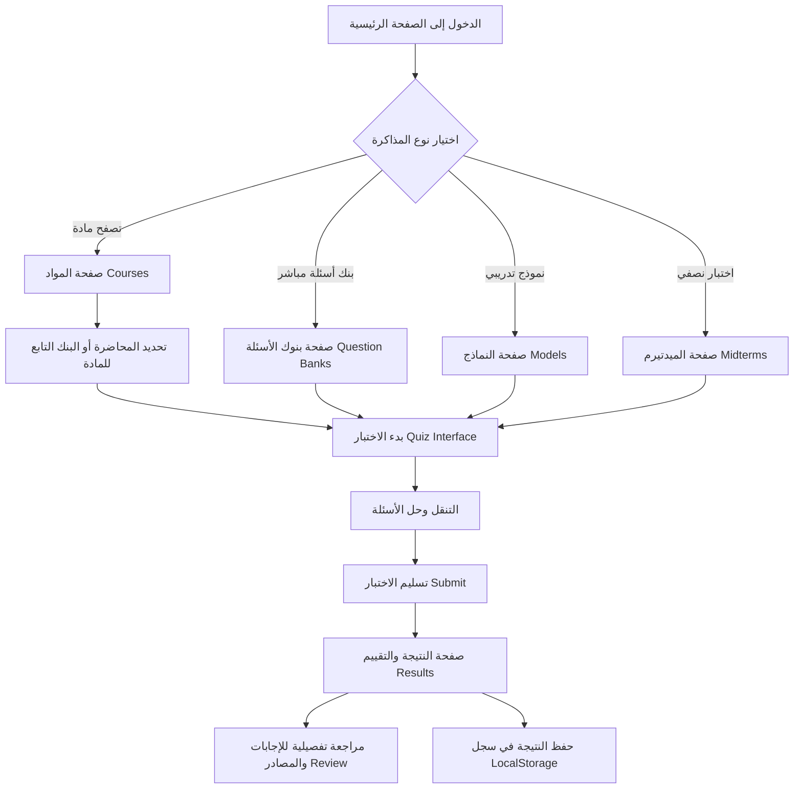

# مسارات المستخدم وسير العمل (User Flows)

توضح هذه الوثيقة تدفق رحلة الطالب داخل المنصة من لحظة دخول الموقع وحتى مراجعة نتائجه وحفظها.

---

## 1. المسار الأساسي (Primary User Journey)

---

## 2. المسارات التفصيلية

### المسار (أ): التدرب عبر بنك أسئلة لمحاضرة معينة
1. ينتقل الطالب إلى قسم **المواد** أو **بنوك الأسئلة**.
2. يختار المادة (مثال: الذكاء الاصطناعي).
3. يختار بنك المحاضرة المطلوبة (مثال: بنك أسئلة المحاضرة الأولى).
4. تفتح صفحة الاختبار مع تحميل أسئلة البنك المحددة في وضع التدريب.
5. يمكن للطالب حل الأسئلة براحة مع خيار إظهار الإجابة أو الحل حتى النهاية.
6. عند الانتهاء والتسليم، تظهر النتيجة والمراجعة.

### المسار (ب): خوض اختبار نصفي تجريبي (Midterm Simulation)
1. ينتقل الطالب إلى قسم **الاختبارات النصفية**.
2. يختار النموذج المفضل (مثال: Midterm - Model A).
3. يطّلع على تعليمات الاختبار: عدد الأسئلة (30 سؤالاً) والوقت المتبقي (45 دقيقة).
4. يضغط على زر **"بدء الاختبار"**.
5. يبدأ المؤقت التنازلي ويتم التنقل عبر الأسئلة.
6. في حال انتهاء الوقت، يتم الإرسال تلقائياً، أو يقوم الطالب بالضغط على **"تسليم الاختبار"**.
7. ينتقل مباشرة إلى صفحة النتيجة ويشاهد تحليلاً دقيقاً ومصادر الأسئلة للأخطاء التي ارتكبها.

### المسار (ج): مراجعة السجل والإعدادات
1. يضغط الطالب على أيقونة **الحساب / السجل** في شريط التنقل.
2. يشاهد قائمة بآخر الاختبارات التي أداها (اسم المادة، النموذج، الدرجة، التاريخ).
3. يمكنه حذف السجل المحلي متى أراد، أو تغيير تفضيلات المظهر (الوضع الليلي / النهاري).
